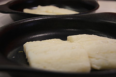

Cod fish, salted and preserved for shipping from norther waters, is a staple of Portuguese cuisine.
Even though you can't find cod swimming off the coasts of Portugal, this fish has found a way to become the Portuguese national dish.

We'll be cooking some up by traditional means and we'd like you to join us.
Take a trip back to Portugal's golden era of shipping and find out how their taste buds fell in love with a foreign fish.

$30 for adults, $12 for children 6-12 years of age 
No host cocktails at 6:00 
Dinner at 7:00 
Saturday, October 22nd 
857 'B' Alvarado St, San Leandro

For tickets, contact: 
Lorenza DLG Tomaz at {directify{Lorenza DLG Tomaz:phone}} 
Conceicao Homen at {directify{Conceicao Homen:phone}} 
Michele Menezes at {directify{Michele Menezes:phone}}
