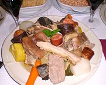

A delicious Portuguese dish combining beef, pork, kale, cabage, carrots and more.

We still have some seats available for this amazing meal. 
The ingredients are so simple, but the result of stewing them together with a few spices is much greater than the sum of their parts.

$30 for adults, $15 for children 6-12 years of age 
Dinner at 7:00 
No-host cocktails at 6:00 
Saturday, March 18th 
857 'B' Alvarado St, San Leandro

For tickets, contact: 
Lorenza DLG Tomaz at {directify{Lorenza DLG Tomaz:phone}} 
Conceicao Homen at {directify{Conceicao Homen:phone}} 
Michele Menezes at {directify{Michele Menezes:phone}}
